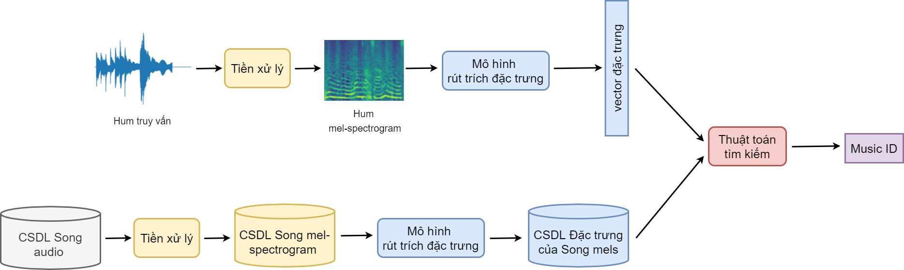

# Zalo AI challenge 2021 task Hum to Song

## pipeline:
<p align="center">
    
</p> 


## Chuẩn bị dữ liệu cho quá trình train:

- Sửa các file đường dẫn trong config/preprocess.yaml
   
  + raw_path: đường dẫn đến data thô
      
  + preprocessed_path: đường dẫn đầu ra của quá trình rút trích mel
      
  + temp_dir: đường dẫn chứa dữ liệu mp3 được chuẩn hóa
      
  - Chạy lần lượt các lệnh sau:

```   
        python preprocessing.py

        python utils/split_train_val_by_id.py
   
        python utils/augment_mp3.py
   
        python utils/preprocess_augment.py
   ```
## Train model:
- Sửa các file đường dẫn trong config/config.py
   
  + meta_train: đường dẫn đến file train_meta.csv trong preprocessed_path
      
  + train_root: đường dẫn đến dữ liệu mel đã tiền xử lý
      
  + train_list = 'full_data_train.txt'
      
  + val_list = 'full_data_val.txt'
      
- Chạy lần lượt các lệnh sau:

```    
        python convert_data.py

        python train.py
```
## Infer public test:

- Đặt dữ liệu mp3 thô ở địa chỉ /data/public_test (bên trong chứa 2 thư mục full_song và hum)
   
- Chạy lần lượt các lệnh sau: 
    
   ```./predict.sh```

## Infer private test:

   Đặt dữ liệu mp3 thô ở địa chỉ /data/private_test (bên trong chứa 2 thư mục full_song và hum)
   
   Chạy lần lượt các lệnh sau:
   
   ```./predict_private_test.sh```

## Team:
   [Võ Văn Phúc](https://github.com/vovanphuc)

   [Nguyễn Văn Thiều](https://github.com/theluckygod)

   [Lâm Bá Thịnh](https://github.com/sasukepn1999)

